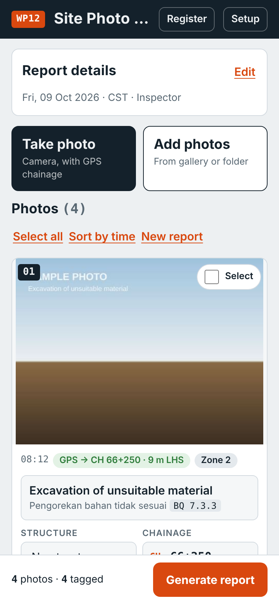
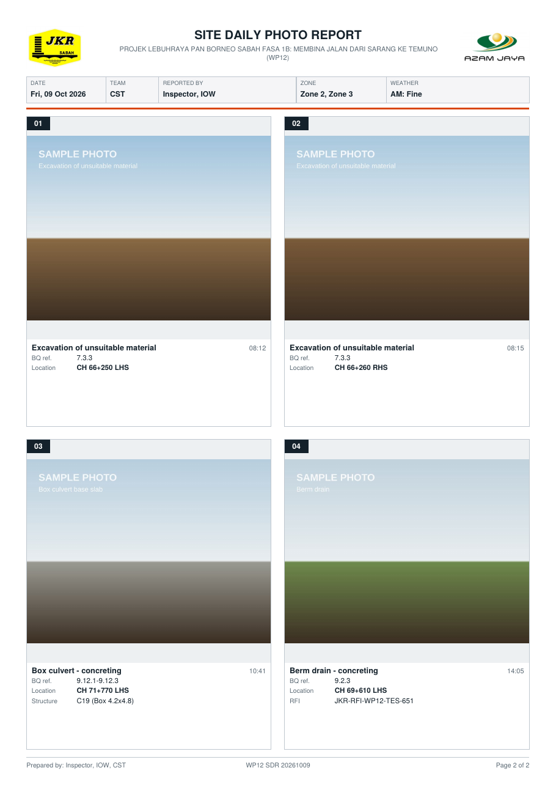
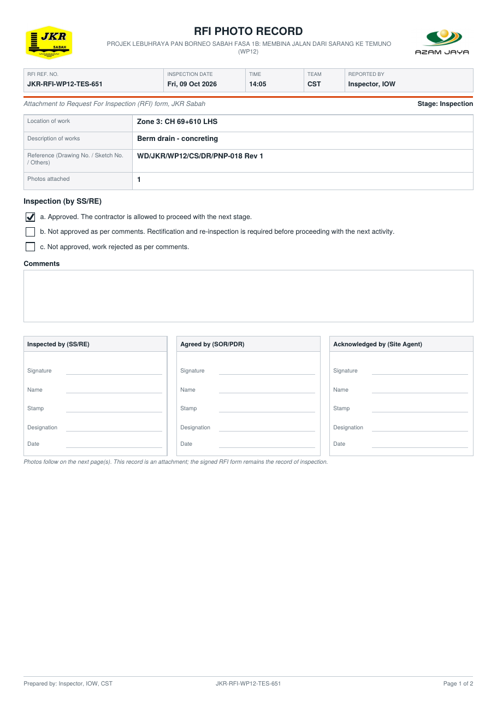

# WP12 Site Photo Report

A web app for recording site work with photos on **Projek Lebuhraya Pan Borneo Sabah Fasa 1B, Work Package 12 (Sarang – Temuno, CH 62+700 to 77+508)**.

Take or add the day's photos, tag each one with the activity (BQ item), chainage, structure and RFI number, then produce a captioned PDF report and photo set to share on WhatsApp and keep on record. It works on iPhone, Android and laptop, in the browser, with nothing to install from an app store.

**Open the app:** use the link under **About** at the top right of this page.

  
  &nbsp;
  

## What it is for

The app is a simple, consistent way to record:

- **site work progress**: what was done, where (chainage, side, structure) and under which BQ item;
- **inspections**: photos tied to the RFI number, with an RFI photo record for closing the RFI;
- **site observations**: ESCP, safety, traffic management, slope condition, weather and site condition;
- **site visits**: a dated, captioned photo record of what was seen.

It is meant for all three parties on the contract: the **Construction Supervision Team (CST)**, the **Works Package Contractor (WPC)** and the **S.O. Representative (SOR)**. Each party uses the same app and keeps its own records and register.

It replaces forwarding loose photos to WhatsApp groups. Those photos are hard to caption one by one, lose their context when forwarded, and often can no longer be downloaded later.

## What it does

| | |
|---|---|
| **Activity list from the contract BQ** | 143 activities grouped by bill (earthworks, ground treatment, drainage, pavement, bridges, road furniture, ESCP, traffic, safety, QA testing & inspection, weather). Each shows its BQ item no., e.g. *Berm drain – concreting · BQ 9.2.3*. Bridge items show the BQ ref for the selected bridge. Search works in English or BM. |
| **QC tests required by the contract** | 50 quality control tests that are not BQ items: joint sampling, laboratory tests, FDT, coring, plate load, CBR, DCP, spray rate, gradation, cube tests (G20–G50, grout), rebound hammer, RC pipe, geotextile and PVD tests. They are marked **QC** in the list and in the report, e.g. *Cube test – G40 · QC*. |
| **More than one activity per photo** | A photo can be tagged with several activities, e.g. *Box culvert – concreting* + *Cube test – G30*. Tap each one in the list, then **Done**. |
| **Chainage from GPS** | Photos with a GPS position get their chainage and side (LHS/RHS) from the WP12 centreline, e.g. *CH 70+000, 20 m RHS*. Chainage can always be typed or adjusted by hand. |
| **Structure list** | Bridges B1–B4, culverts C1–C32, junction culverts JC1–JC13 and the reinforced soil walls. Picking one fills in its drawing chainage, which you then adjust to the actual site position. |
| **Tag many photos at once** | Select several photos and apply the same activity, chainage, side or RFI no. in one step. |
| **PDF report** | A4, 4 photos per page, with the JKR and contractor logos, report details, weather, an optional summary table, and a caption under each photo. Captions in English, Bahasa Malaysia, or both. |
| **Captioned photos** | Each photo with the date, time, chainage, activity, BQ ref and RFI printed on it, renamed in order (e.g. `20261009_CST_03_CH71+770_Box-culvert-concreting.jpg`). The caption stays with the photo when it is forwarded. |
| **RFI photo record** | One PDF per RFI no., set out to accompany the JKR Sabah *Request For Inspection* form (Arahan Jabatan Bil. 11/2026). It has the location, description, drawing reference, inspection result boxes, comments, sign-off blocks: Prepared by (WPC), Checked by (CST) and Acknowledged by (SOR), and the photos. |
| **WhatsApp message** | A short list of activities and chainages to paste with the PDF. |
| **Register log** | Every report saved or shared is logged on the device, with Reports, RFIs and Photos views, filters and CSV export (opens in Excel). Logs from other users can be imported. |
| **Works offline** | Once opened, it works without signal on site. Drafts are kept if the phone closes the browser. |

## Getting started

1. Open the link under **About** on your phone.
2. Add it to the home screen:
   - **iPhone (Safari):** Share → *Add to Home Screen*
   - **Android (Chrome):** menu ⋮ → *Install app* or *Add to home screen*
3. Open it from the home screen icon. The project setup (logos, zones, activity list, structures and centreline) loads by itself.
4. In **Report details**, choose your team (CST, WPC or SOR) and enter your name and designation. These are remembered.
5. Allow location when the camera asks, so photos taken in the app get their chainage.

## Daily use

1. **Take photo** at site, or **Add photos** from the gallery afterwards.
2. For each photo, or for several selected together, choose the **activity** (one or more) and check the **chainage** and **side**. Add the structure, element (e.g. A1, P2, pile 5), RFI no. and remarks where needed.
3. Tap **Generate report**, then:
   - **Share PDF**: pick WhatsApp and the group;
   - **Share photos**: the captioned photos;
   - **Copy text**: the WhatsApp summary;
   - **RFI photo record**: one per RFI, to attach to the RFI form;
   - **Save ZIP**: everything, plus a CSV photo log, for your own files.
4. Start the next day with **New report**.

RFI numbers use the fixed prefix `JKR-RFI-WP12-`, so only the trade code and number are typed, e.g. `TES-651`.

## Records and data

- **There is no server and no login.** Photos, reports and the register stay on the phone or laptop that made them. Nothing is uploaded to this site.
- Each party keeps its own records: the PDF and ZIP files it saves, and the **Register** in the app. Export the register to CSV regularly and keep it with your project files. Clearing the browser's data removes it from the device.
- To combine records, import other users' `photo_log.csv` (inside their ZIP) under **Register → Import log**.
- A team that wants one shared register can connect the app to its own Google Sheet (Setup → *Team register*). The guide is in [TEAM_REGISTER.md](TEAM_REGISTER.md) and the script is [Code.gs](Code.gs). It is optional, and the sheet belongs to that team.
- This repository is public. It holds only the app, the logos, the activity list (BQ item numbers, no rates), structure chainages and the road centreline.

## Accuracy notes

- Phone GPS is typically accurate to about 5–10 m, so GPS chainage is rounded to the nearest 5 m. Check it against site pegs where it matters.
- The centreline is the tender alignment from the project KMZ. Structure chainages are taken from the drawings and BQ and are **indicative only**.
- The app produces photo records. It does not replace the contract documents, the signed RFI form or formal correspondence.

## Updating the setup

The file `setup.json` holds the project setup for everyone: logos, project title, zones, activity list, structures and centreline.

1. In the app, make the change in **Setup** (for example *Add an activity*), then tap **Save setup file**. It saves as `setup.json`.
2. In this repository: **Add file → Upload files**, drop in the new `setup.json`, then **Commit changes**.
3. Phones pick it up the next time the app is opened with signal.

A new version of the app (`index.html`) is updated the same way.

## Using it on other work packages

The app is built so the project data is separate from the app itself. For another work package, make a copy of this repository (e.g. `wp13-sdr`) and replace `setup.json` with that package's:

- project title, contract no. and RFI prefix;
- chainage limits and zones;
- activity list, prepared from that package's BQ;
- structure list (bridges, culverts and so on), from its drawings;
- road centreline with chainages, from the alignment KMZ or setting-out data;
- client and contractor logos.

## Version history and roadmap

The current version is shown in the app under **Setup** (bottom panel). Changes are listed in [CHANGELOG.md](CHANGELOG.md). The pilot and rollout plan and the features under consideration are in [ROADMAP.md](ROADMAP.md).

## Files

| File | What it is |
|---|---|
| `index.html` | The app |
| `setup.json` | Project setup: logos, zones, activities, structures, centreline |
| `manifest.webmanifest`, `sw.js`, `icon-192.png`, `icon-512.png` | Let the app install on a phone and work offline |
| `CHANGELOG.md` | Revision history |
| `ROADMAP.md` | Pilot and rollout plan, future features |
| `TEAM_REGISTER.md`, `Code.gs` | Optional: guide and script for a team register in Google Sheets |
| `screenshot-*.png` | Pictures used on this page |

## Ringkasan (BM)

Aplikasi web untuk merekod kerja tapak, pemeriksaan, pemerhatian dan lawatan tapak WP12 menggunakan foto. Setiap foto ditanda dengan aktiviti (item BQ), rantaian (chainage), struktur dan no. RFI. Aplikasi kemudian menghasilkan laporan PDF (4 foto setiap muka surat), foto berkapsyen, rekod foto RFI dan log daftar. Ia boleh digunakan oleh CST, WPC dan SOR pada iPhone, Android dan komputer riba. Semua data disimpan dalam peranti pengguna sendiri.

---

Developed for the WP12 Construction Supervision Team. Maintained by Br. Ts. Willon Paul Nanak, Resident Engineer.
